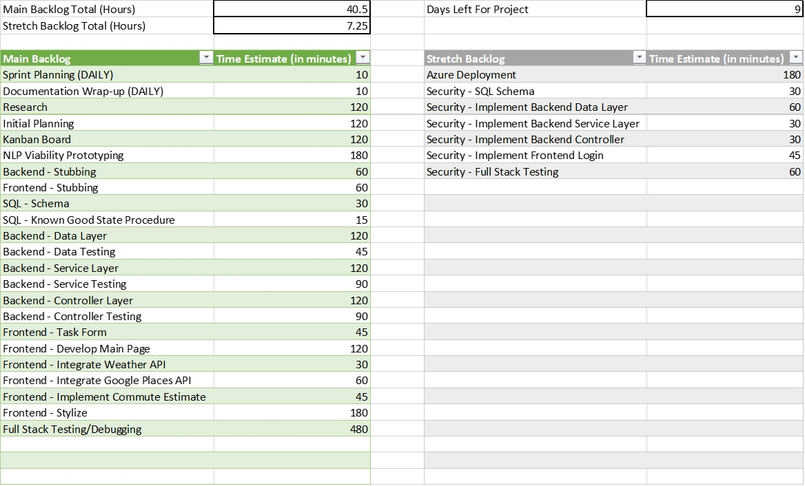

# Dev10 Capstone

## Introduction
The `SmartTasker` is a multi-faceted  tasks list that helps a user complete their tasks by helping to prioritize tasks whose completion  may be affected by external forces. The application will do this by providing weather and location information for relevant tasks.

***

## Table of Contents
1. [In-Depth Functionality](#in-depth-functionality)

   - [Main Functionality](#main-functionality)

   - [Stretch Functionality](#stretch-functionality)

2. [Learning Goal](#learning-goal)

3. [Plan](#plan)

   - [Agile Framework](#agile-framework)

   - [Kanban Tasks](#kanban-tasks)

4. [User Story](#user-story)

***

## In-Depth Functionality

### Main Functionality
- Provide a form for users to input tasks _(* is required)_
  - Name of Task *
  - Due Date
  - Location of Task _(* if outside house)_
  - Is it an outdoor task? (Boolean) *
  - Other Details
- List tasks
- Filter Tasks
- List weather for tasks listed as outdoors
- List store/location hours for tasks at external location
  - List estimated commute time from home to second location
- Prioritize tasks based on due date, potential weather, and location closing times.

### Stretch Functionality
- Replace 'Is it an outdoor task?' with NLP to automatically infer if task is an outdoor task.
  - Use either Maven Stanford NLP or IBM Watson NLP
- Separate user accounts
- Link with Google Calendar (super stretch goal)

***

## Learning Goal
- Host application on Azure or AWS. (Azure is looking like a better option because of their less restrictive free tier offerings.)
- (Stretch) Implement NLP to better understand nature of user tasks.

***
## Plan

### Agile Framework
I am running a modified version of `Scrum for One with Kanban` for this project. All tasks are listed in the main backlog in priority order and with time estimates (except for stretch goals, which are in the stretch backlog). Sprints are only 1 day long (due to the short length of this project). Sprint planning happens daily first thing in the morning; approximatly 8 hours of tasks are moved into the sprint backlog from the top of the main backlog. That sprint is now set for the day; should a new task need to be added, it will be placed in the main backlog based on urgency. Each day ends with a documentation wrap-up, which is used to organize the kanban board and leave notes for future development days.

*(I know this strays from traditional Scrum and Kanban principles, but I have used and refined this modified version for several years now; it helps me organize small-scale and short term projects.)*

### Kanban Tasks

***

## User Story

*(Assume the date is Mon, 8/3/2020)*

### 1. User adds tasks
   - Do laundry (Outdoors: No)
   - Cut Lawn (Outdoors: Yes)
   - Go Grocery Shopping (Location: Lidi, Outdoors: No)
   - Schedule Apt at DMV (Due Date: 8/6/2020, Location: DMV, Outdoors: No)
   
### 2. On tasks screen, user sees tasks added.

| Task | Due Date | Location | Outdoors? | User Details |
|:---:|:---:|:---:|:---:|:---:|
| Do Laundry | | | No | |
| Cut Lawn | | | Yes | | 
| Go Grocery Shopping | | Lidl | No | Need Eggs | 
| Schedule Apt at DMV | 8/9/2020 | DMV | No | Renew License |

### 3. On home-screen, user sees tasks with pertinent external info.
  

| Task | Due Date | Task Information | User Details |
|:---:|:---:|:---:|:---:|
| Do Laundry | | | |
| Cut Lawn | |Sunny Tomorrow, Rain Next 7 Days | |
| Go Grocery Shopping | | Closes 9pm Everyday | Need Eggs |
| Schedule Apt at DMV | 8/7/2020* | Closes 4:30pm Next 5 Days, Closed Sat & Sun | Renew License |

    * Note Due Date Change Due to Location Being Closed on Original Due Date

### 4. User can ask application to suggest task prioritization based on external factors.

| Task Priority | Task | Due Date | Task Information | User Details |
|:---:|:---:|:---:|:---:|:---:|
| 1 | Cut Lawn | |Sunny Tomorrow, Rain Next 7 Days | |
| 2 | Schedule Apt at DMV | 8/7/2020* | Closes 4:30pm Next 5 Days, Closed Sat & Sun | Renew License |
| 3 | Go Grocery Shopping | | Closes 9pm Everyday | Need Eggs |
| 4 | Do Laundry | | | |

### 5. The list will reprioritize on-the-fly as new tasks are added.

| Task Priority | Task | Due Date | Task Information | User Details |
|:---:|:---:|:---:|:---:|:---:|
| 1 | Email Boss | 8/4/2020 | | Send Report |
| 2 | Cut Lawn | |Sunny Tomorrow, Rain Next 7 Days | |
| 3 | Schedule Apt at DMV | 8/7/2020* | Closes 4:30pm Next 5 Days, Closed Sat & Sun | Renew License |
| 4 | Go Grocery Shopping | | Closes 9pm Everyday | Need Eggs |
| 5 | Do Laundry | | | |

